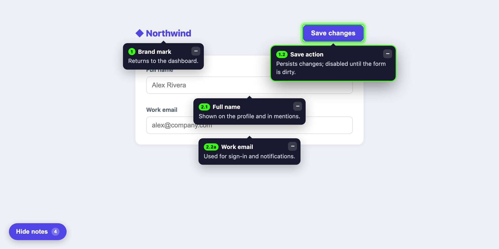

# annotations

Drop-in, **framework-agnostic** prototype annotations. Design authors labelled callouts that point at UI elements; engineering & QA read them. Copy lives in a **Google Sheet** (or a JSON file), so non-engineers edit annotations without touching code.



- **Works anywhere** — plain HTML, React, Vue, Svelte, any version. Preact is bundled in; it never touches the host's framework.
- **Style-isolated** — the whole UI renders inside a Shadow DOM root, so host CSS can't bleed in and its styles can't leak out.
- **No backend, no API keys** — content is fetched from a *published* sheet (or a committed JSON snapshot).
- **Off by default** — a small floating button toggles annotations on; they never clutter the app unprompted.

## How anchoring works

Add a `data-annote="<name>"` attribute to any host element you want to annotate, then reference that name in the `target` column of your sheet. Explicit attributes are more robust than inferred CSS selectors — they survive markup changes.

```html
<button data-annote="start-visit">Start visit</button>
```

## Install

**CDN / script tag (zero install, auto-boots from `data-*`):**

```html
<script
  src="https://cdn.jsdelivr.net/npm/annotations"
  data-sheet="https://docs.google.com/spreadsheets/d/e/XXXX/pub?output=csv"
></script>
```

**npm:**

```bash
npm install annotations
```

```ts
import { Annotations } from "annotations";

Annotations.init({
  sheetUrl: "https://docs.google.com/spreadsheets/d/e/XXXX/pub?output=csv",
});
```

## The sheet

Publish a Google Sheet to the web as CSV (**File → Share → Publish to web → CSV**). One annotation per row:

| Column      | Required | Notes |
| ----------- | -------- | ----- |
| `target`    | ✓        | Matches a host element's `data-annote` value. |
| `title`     | ✓        | Short heading. |
| `body`      |          | Annotation copy (plain text). |
| `number`    |          | Display label shown in the badge — free-form, so dotted/suffixed values like `1.2` or `1.2a` work. Falls back to an auto index when blank. |
| `placement` |          | `top` \| `bottom` \| `left` \| `right` (default `bottom`). |
| `order`     |          | Sort order (numeric). |
| `id`        |          | Stable id (defaults to `target`-derived). |
| `enabled`   |          | `FALSE` hides a row without deleting it. |

Each callout has a **minimize** button (`−`) that collapses it to just its number badge; click the badge to expand it again. When callouts overlap, **click one to bring it to the front**.

### Clustering close-together notes

When several annotations target elements that sit very close together, they'd otherwise crowd the same spot. They're automatically **merged into one grouped bubble** ("2 notes here") that lists each note; hovering a row highlights that note's own element. Tune or disable it with `clusterDistance` (px gap, default `16`; `0` disables).

Collapsed, a group shows a **stack glyph** next to the number of notes in it, so a group of 2 is never misread as note 2 — a plain badge is always one note's own number.

## API

```ts
Annotations.init(config?: AnnotationsConfig): void
Annotations.show(): void
Annotations.hide(): void
Annotations.toggle(): void
Annotations.collapseAll(): void      // collapse every note to its number badge
Annotations.expandAll(): void
Annotations.toggleCollapseAll(): void
Annotations.isCollapsed(): boolean
Annotations.refresh(): void   // force a re-scan of targets
Annotations.destroy(): void
```

### `AnnotationsConfig`

| Option        | Type            | Default        | Description |
| ------------- | --------------- | -------------- | ----------- |
| `sheetUrl`    | `string`        | —              | Published Google Sheet CSV URL. |
| `snapshotUrl` | `string`        | —              | Committed JSON (`Annotation[]`) for offline/network-independent demos. Wins over `sheetUrl`. |
| `annotations` | `Annotation[]`  | —              | Inline annotations (skip fetching). Highest precedence. |
| `attribute`   | `string`        | `"data-annote"`| Host element hook attribute. |
| `pollMs`      | `number`        | `0`            | Re-fetch every N ms (0 = off). Published sheets have a few-minute cache. |
| `startVisible`| `boolean`       | `false`        | Show immediately instead of waiting for the toggle. |
| `observe`     | `boolean`       | `true`         | Watch the DOM and re-anchor as SPA targets mount/unmount. |
| `clusterDistance` | `number`    | `16`           | Merge notes whose targets are within this many px into one grouped bubble. `0` disables. |
| `toggleButton`| `boolean`       | `true`         | Render the built-in floating show/hide button. Set `false` when another UI (e.g. [proto-nav](../proto-nav)'s `notesToggle`) controls visibility. |
| `debug`       | `boolean`       | `false`        | Log missing targets and fetch errors. |

When annotations overlap, **click a callout to bring it to the front**. Each callout also minimizes to a number badge via its `−` button, and `collapseAll()` does that to every note at once — the notes stay anchored on the page, just out of the way (that's what [proto-nav](../proto-nav)'s toolbar "Collapse all" drives). The API also exposes `Annotations.isVisible()` and `Annotations.isCollapsed()` so external UIs can reflect the current state.

Config also resolves from the `<script>` tag's `data-*` attributes (`data-sheet`, `data-snapshot`, `data-attribute`, `data-poll`, `data-start-visible`, `data-observe`, `data-cluster-distance`, `data-debug`) or a `window.AnnotationsConfig` global. Precedence: `init()` argument › `window.AnnotationsConfig` › script `data-*`.

Missing targets are skipped silently (logged in `debug` mode), so a sheet shared across pages only shows the annotations whose targets exist on the current page.

## License

MIT
