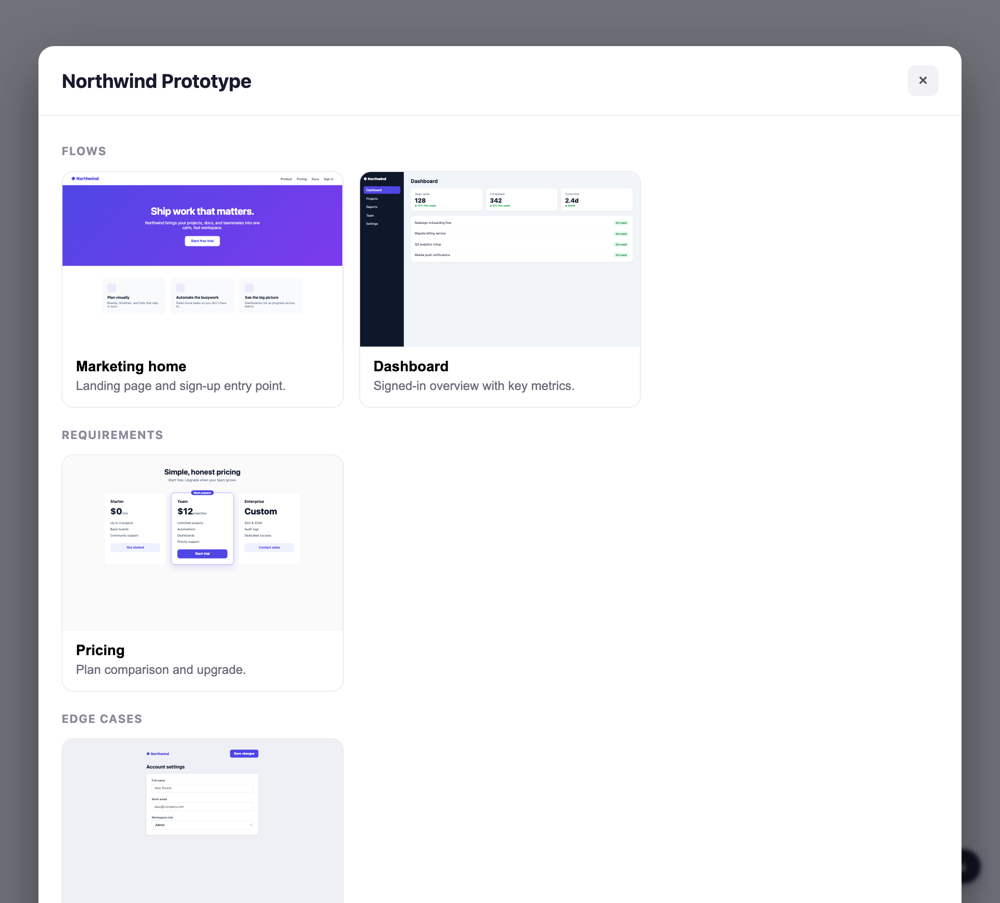

# proto-nav

A tiny, **framework-agnostic** prototype navigator. Drop it into any web prototype and it renders a landing **gallery of flow cards** (grouped as flows / requirements / edge cases) that deep-link into each flow, plus a **persistent, draggable floating toolbar** on every page — a Menu button to open the gallery and (with `notesToggle`) Show/Hide notes and Collapse/Expand all buttons — that you can drag anywhere by its grip. Toolbar controls are icon-only, with their label in a hover tooltip.



- **Works anywhere** — plain HTML, React, Vue, Svelte, any version. Preact is bundled in; it never touches the host's framework.
- **Style-isolated** — the whole UI renders inside a Shadow DOM root, so host CSS can't bleed in and its styles can't leak out.
- **No backend** — navigation is a full page load; you only provide a list of `{ title, url }`.

## Install

**CDN / script tag (zero install):**

```html
<script src="https://cdn.jsdelivr.net/npm/@proto-collab/nav"></script>
<script>
  ProtoNav.init({
    title: "My Prototype",
    entries: [
      { title: "Chat Intake", url: "/ui/chat", type: "flow" },
      { title: "Consent required", url: "/ui/consent", type: "requirement" },
      { title: "Emergency interstitial", url: "/ui/911", type: "edge-case" }
    ]
  });
</script>
```

**npm:**

```bash
npm install @proto-collab/nav
```

```ts
import { ProtoNav } from "@proto-collab/nav";

ProtoNav.init({ src: "/proto-nav.json" }); // or inline `entries`
```

## API

```ts
ProtoNav.init(config: ProtoNavConfig): void  // mount button + gallery (idempotent)
ProtoNav.open(): void
ProtoNav.close(): void
ProtoNav.destroy(): void
```

### `ProtoNavConfig`

| Option            | Type                                                          | Default          | Description |
| ----------------- | ------------------------------------------------------------ | ---------------- | ----------- |
| `entries`         | `Entry[]`                                                    | —                | Inline entries. Highest precedence (`entries` > `sheet` > `src`). |
| `sheet`           | `string`                                                    | —                | URL of a published Google Sheet (or any CSV) to build entries from. See [Authoring in a sheet](#authoring-in-a-sheet). |
| `src`             | `string`                                                    | —                | URL to fetch a config: JSON (`Entry[]` or `{ entries, title }`) **or** a CSV — the format is auto-detected. |
| `title`           | `string`                                                    | `"Prototypes"`   | Gallery heading. |
| `position`        | `"bottom-right" \| "bottom-left" \| "top-right" \| "top-left"` | `"bottom-right"` | Toolbar corner. |
| `draggable`       | `boolean`                                                    | `true`           | Drag the toolbar by its grip; position persists in `localStorage`. |
| `startOpen`       | `boolean`                                                    | `false`          | Open the gallery immediately on load, every time. |
| `openOnFirstLoad` | `boolean`                                                    | `false`          | Open the gallery on load only if no entry URL matches the current page. |
| `previews`        | `boolean`                                                    | `true`           | Use a live iframe preview of each flow as its card thumbnail (a per-entry `thumbnail` always wins). Pages that forbid framing render blank — set a `thumbnail` for those, or `previews: false` for placeholders. |
| `notesToggle`     | `boolean`                                                    | `false`          | Add the notes controls to the floating toolbar — "Show / Hide notes" and "Collapse / Expand all", which leaves every note on the page as a number badge instead of hiding it — plus a "Show / Hide notes" control in the gallery header. They drive the [`annotations`](../annotations) widget via its `window.Annotations` global. Pair with the annotations widget's `toggleButton: false`. |

### `Entry`

```ts
interface Entry {
  title: string;        // card title
  url: string;          // navigated to via a full page load
  id?: string;          // defaults to a slug of `title`
  type?: string;        // grouping bucket; default "flow"
  description?: string; // supporting copy under the title
  thumbnail?: string;   // image URL; falls back to a generated placeholder
}
```

Entries are grouped by `type`. `flow`, `requirement`, and `edge-case` get friendly section headings; any other value is title-cased and used as its own section. The card matching the current URL is highlighted automatically.

## Authoring in a sheet

Let a designer own the menu — links, titles, descriptions — in a spreadsheet, no code edits required. Make a Google Sheet with a header row, then **File → Share → Publish to web → CSV**, and hand proto-nav the published URL:

```js
ProtoNav.init({ sheet: "https://docs.google.com/spreadsheets/d/…/pub?output=csv" });
```

The published CSV is also auto-detected through `src`, so a `.csv` file or `output=csv` URL works there too:

```js
ProtoNav.init({ src: "/menu.csv" }); // JSON vs CSV is detected automatically
```

Columns are matched by header name (case-insensitive, any order); unknown columns are ignored:

| Column        | Required | Maps to                                             |
| ------------- | -------- | --------------------------------------------------- |
| `title`       | ✅       | `Entry.title` |
| `url`         | ✅       | `Entry.url` |
| `type`        |          | `Entry.type` (grouping bucket; default `flow`) |
| `description` |          | `Entry.description` (alias: `desc`) |
| `id`          |          | `Entry.id` (defaults to a slug of `title`) |
| `thumbnail`   |          | `Entry.thumbnail` (alias: `thumb`) |
| `enabled`     |          | Set `FALSE` / `no` / `0` to hide a row without deleting it |

Rows missing `title` or `url` (and blank rows) are skipped. Because it's a live published CSV, editing the sheet updates the menu on the next page load — no redeploy.

## License

MIT
